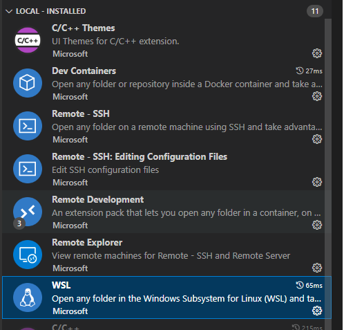
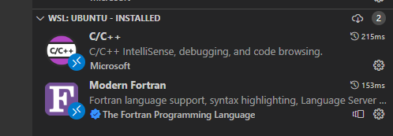

# gfortran_wsl


1. Be sure that the correct extensions are loaded:

### Locally



### In Ubuntu (WSL)



2. First be sure that the correct apps are installed.
```bash
sudo apt-get update
sudo apt-get install build-essential gdb
sudo apt-get install gfortran
```

3. Then include the following blocks for the `tasks.json`:
```json
{
    "version": "2.0.0",
    "tasks": [
      {
        "type": "shell",
        "label": "gfortran build active file",
        "command": "/usr/bin/gfortran",
        "args": ["-g", "${file}", "-o", "${fileDirname}/${fileBasenameNoExtension}.out"],
        "options": {
          "cwd": "/usr/bin"
        },
        "problemMatcher": ["$gcc"],
        "group": {
          "kind": "build",
          "isDefault": true
        }
      }
    ]
}
```
4. The following block should be included within the `launch.json`:
```json
{
  "version": "0.2.0",
  "configurations": [
    {
      "name": "gfortran build and debug active file",
      "type": "cppdbg",
      "request": "launch",
      "program": "${fileDirname}/${fileBasenameNoExtension}.out",
      "args": [],
      "stopAtEntry": false,
      "cwd": "${workspaceFolder}",
      "environment": [],
      "externalConsole": false,
      "MIMode": "gdb",
      "setupCommands": [
        {
          "description": "Enable pretty-printing for gdb",
          "text": "-enable-pretty-printing",
          "ignoreFailures": true
        }
      ],
      "preLaunchTask": "gfortran build active file",
      "miDebuggerPath": "/usr/bin/gdb"
    }
  ]
}
```

Write a sample program, for example:
```fortran
program test
    implicit none

    integer(4) :: i = 50

    print *,"KEFTEDES!"

    print *,calc(i)
    

contains
    pure integer(4) function calc(x)
        integer(4),intent(in)::x
        calc = 10*x
    end function
end program
```

## Notes


### Install pip for Python3

```console
cliff@DESKTOP-D131KNR:~/mycode/fortran/fort1$ sudo apt install python3-pip
Reading package lists... Done
Building dependency tree... Done
Reading state information... Done
The following additional packages will be installed:
  javascript-common libexpat1-dev libjs-jquery libjs-sphinxdoc libjs-underscore libpython3-dev libpython3.10-dev
  python3-dev python3-distutils python3-lib2to3 python3-setuptools python3-wheel python3.10-dev zlib1g-dev
Suggested packages:
  apache2 | lighttpd | httpd python-setuptools-doc
The following NEW packages will be installed:
  javascript-common libexpat1-dev libjs-jquery libjs-sphinxdoc libjs-underscore libpython3-dev libpython3.10-dev
  python3-dev python3-distutils python3-lib2to3 python3-pip python3-setuptools python3-wheel python3.10-dev zlib1g-dev
0 upgraded, 15 newly installed, 0 to remove and 0 not upgraded.
Need to get 8084 kB of archives.
After this operation, 34.6 MB of additional disk space will be used.
Do you want to continue? [Y/n] y
Get:1 http://archive.ubuntu.com/ubuntu jammy/main amd64 javascript-common all 11+nmu1 [5936 B]
Get:2 http://archive.ubuntu.com/ubuntu jammy-updates/main amd64 libexpat1-dev amd64 2.4.7-1ubuntu0.2 [147 kB]
Get:3 http://archive.ubuntu.com/ubuntu jammy/main amd64 libjs-jquery all 3.6.0+dfsg+~3.5.13-1 [321 kB]
Get:4 http://archive.ubuntu.com/ubuntu jammy/main amd64 libjs-underscore all 1.13.2~dfsg-2 [118 kB]
Get:5 http://archive.ubuntu.com/ubuntu jammy/main amd64 libjs-sphinxdoc all 4.3.2-1 [139 kB]
Get:6 http://archive.ubuntu.com/ubuntu jammy-updates/main amd64 zlib1g-dev amd64 1:1.2.11.dfsg-2ubuntu9.2 [164 kB]
Get:7 http://archive.ubuntu.com/ubuntu jammy-updates/main amd64 libpython3.10-dev amd64 3.10.6-1~22.04.2 [4755 kB]
Get:8 http://archive.ubuntu.com/ubuntu jammy-updates/main amd64 libpython3-dev amd64 3.10.6-1~22.04 [7166 B]
Get:9 http://archive.ubuntu.com/ubuntu jammy-updates/main amd64 python3.10-dev amd64 3.10.6-1~22.04.2 [507 kB]
Get:10 http://archive.ubuntu.com/ubuntu jammy-updates/main amd64 python3-lib2to3 all 3.10.6-1~22.04 [77.6 kB]
Get:11 http://archive.ubuntu.com/ubuntu jammy-updates/main amd64 python3-distutils all 3.10.6-1~22.04 [139 kB]
Get:12 http://archive.ubuntu.com/ubuntu jammy-updates/main amd64 python3-dev amd64 3.10.6-1~22.04 [26.0 kB]
Get:13 http://archive.ubuntu.com/ubuntu jammy/main amd64 python3-setuptools all 59.6.0-1.2 [339 kB]
Get:14 http://archive.ubuntu.com/ubuntu jammy/universe amd64 python3-wheel all 0.37.1-2 [31.9 kB]
Get:15 http://archive.ubuntu.com/ubuntu jammy/universe amd64 python3-pip all 22.0.2+dfsg-1 [1306 kB]
Fetched 8084 kB in 2s (3469 kB/s)
Selecting previously unselected package javascript-common.
(Reading database ... 30694 files and directories currently installed.)
Preparing to unpack .../00-javascript-common_11+nmu1_all.deb ...
Unpacking javascript-common (11+nmu1) ...
Selecting previously unselected package libexpat1-dev:amd64.
Preparing to unpack .../01-libexpat1-dev_2.4.7-1ubuntu0.2_amd64.deb ...
Unpacking libexpat1-dev:amd64 (2.4.7-1ubuntu0.2) ...
Selecting previously unselected package libjs-jquery.
Preparing to unpack .../02-libjs-jquery_3.6.0+dfsg+~3.5.13-1_all.deb ...
Unpacking libjs-jquery (3.6.0+dfsg+~3.5.13-1) ...
Selecting previously unselected package libjs-underscore.
Preparing to unpack .../03-libjs-underscore_1.13.2~dfsg-2_all.deb ...
Unpacking libjs-underscore (1.13.2~dfsg-2) ...
Selecting previously unselected package libjs-sphinxdoc.
Preparing to unpack .../04-libjs-sphinxdoc_4.3.2-1_all.deb ...
Unpacking libjs-sphinxdoc (4.3.2-1) ...
Selecting previously unselected package zlib1g-dev:amd64.
Preparing to unpack .../05-zlib1g-dev_1%3a1.2.11.dfsg-2ubuntu9.2_amd64.deb ...
Unpacking zlib1g-dev:amd64 (1:1.2.11.dfsg-2ubuntu9.2) ...
Selecting previously unselected package libpython3.10-dev:amd64.
Preparing to unpack .../06-libpython3.10-dev_3.10.6-1~22.04.2_amd64.deb ...
Unpacking libpython3.10-dev:amd64 (3.10.6-1~22.04.2) ...
Selecting previously unselected package libpython3-dev:amd64.
Preparing to unpack .../07-libpython3-dev_3.10.6-1~22.04_amd64.deb ...
Unpacking libpython3-dev:amd64 (3.10.6-1~22.04) ...
Selecting previously unselected package python3.10-dev.
Preparing to unpack .../08-python3.10-dev_3.10.6-1~22.04.2_amd64.deb ...
Unpacking python3.10-dev (3.10.6-1~22.04.2) ...
Selecting previously unselected package python3-lib2to3.
Preparing to unpack .../09-python3-lib2to3_3.10.6-1~22.04_all.deb ...
Unpacking python3-lib2to3 (3.10.6-1~22.04) ...
Selecting previously unselected package python3-distutils.
Preparing to unpack .../10-python3-distutils_3.10.6-1~22.04_all.deb ...
Unpacking python3-distutils (3.10.6-1~22.04) ...
Selecting previously unselected package python3-dev.
Preparing to unpack .../11-python3-dev_3.10.6-1~22.04_amd64.deb ...
Unpacking python3-dev (3.10.6-1~22.04) ...
Selecting previously unselected package python3-setuptools.
Preparing to unpack .../12-python3-setuptools_59.6.0-1.2_all.deb ...
Unpacking python3-setuptools (59.6.0-1.2) ...
Selecting previously unselected package python3-wheel.
Preparing to unpack .../13-python3-wheel_0.37.1-2_all.deb ...
Unpacking python3-wheel (0.37.1-2) ...
Selecting previously unselected package python3-pip.
Preparing to unpack .../14-python3-pip_22.0.2+dfsg-1_all.deb ...
Unpacking python3-pip (22.0.2+dfsg-1) ...
Setting up javascript-common (11+nmu1) ...
Setting up libexpat1-dev:amd64 (2.4.7-1ubuntu0.2) ...
Setting up zlib1g-dev:amd64 (1:1.2.11.dfsg-2ubuntu9.2) ...
Setting up libjs-jquery (3.6.0+dfsg+~3.5.13-1) ...
Setting up python3-lib2to3 (3.10.6-1~22.04) ...
Setting up libjs-underscore (1.13.2~dfsg-2) ...
Setting up python3-distutils (3.10.6-1~22.04) ...
Setting up python3-setuptools (59.6.0-1.2) ...
Setting up python3-wheel (0.37.1-2) ...
Setting up libpython3.10-dev:amd64 (3.10.6-1~22.04.2) ...
Setting up python3-pip (22.0.2+dfsg-1) ...
Setting up libjs-sphinxdoc (4.3.2-1) ...
Setting up python3.10-dev (3.10.6-1~22.04.2) ...
Setting up libpython3-dev:amd64 (3.10.6-1~22.04) ...
Setting up python3-dev (3.10.6-1~22.04) ...
Processing triggers for man-db (2.10.2-1) ...
```

### Install fortls

```console
cliff@DESKTOP-D131KNR:~/mycode/fortran/fort1$ pip3 install fortls
Defaulting to user installation because normal site-packages is not writeable
Collecting fortls
  Downloading fortls-2.13.0-py3-none-any.whl (92 kB)
     ━━━━━━━━━━━━━━━━━━━━━━━━━━━━━━━━━━━━━━━━ 92.5/92.5 KB 877.0 kB/s eta 0:00:00
Collecting packaging
  Downloading packaging-22.0-py3-none-any.whl (42 kB)
     ━━━━━━━━━━━━━━━━━━━━━━━━━━━━━━━━━━━━━━━━ 42.6/42.6 KB 4.3 MB/s eta 0:00:00
Collecting json5
  Downloading json5-0.9.10-py2.py3-none-any.whl (19 kB)
Installing collected packages: json5, packaging, fortls
  WARNING: The script pyjson5 is installed in '/home/cliff/.local/bin' which is not on PATH.
  Consider adding this directory to PATH or, if you prefer to suppress this warning, use --no-warn-script-location.
  WARNING: The script fortls is installed in '/home/cliff/.local/bin' which is not on PATH.
  Consider adding this directory to PATH or, if you prefer to suppress this warning, use --no-warn-script-location.
Successfully installed fortls-2.13.0 json5-0.9.10 packaging-22.0
```
